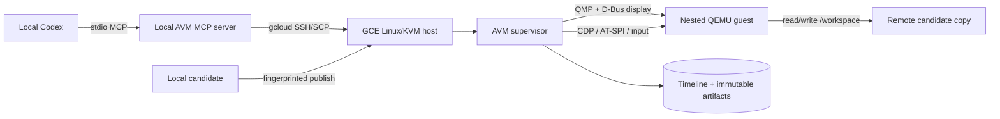

# AVM

[](https://github.com/artpar/avm/actions/workflows/ci.yml)
[](https://github.com/artpar/avm/releases/latest)
[](LICENSE)

AVM is a host-owned, instrumented virtual computer for software-development
agents. It runs an untrusted candidate project inside a nested graphical Linux
guest while a trusted supervisor records what the guest displayed, what input
was sent, what the browser did, and which repository version produced the
result.

Codex stays on your local workstation. An explicit `gcloud compute ssh` channel
connects it to the Linux/KVM host, so no Codex login or ChatGPT credential is
placed on the VM.

> AVM is a pre-1.0 research system. It has passed its scoped acceptance gates on
> GCE nested virtualization, but it is not a general-purpose VM manager or a
> hardened multi-tenant sandbox.

## Why AVM?

Ordinary coding agents can inspect files and command output, but graphical
behavior is easy to miss and hard to prove. AVM gives an agent and evaluator a
shared, persistent record:

- QEMU/KVM lifecycle with clean snapshot-backed resets;
- authoritative QEMU D-Bus framebuffer capture and recorded mouse/keyboard
  input;
- browser DOM, accessibility, console, network, performance, screenshots, and
  traces over CDP;
- native AT-SPI observation, runtime telemetry, host-side audio, and temporal
  visual analysis;
- a canonical SQLite timeline plus immutable SHA-256 artifact storage;
- historical frame reconstruction, replay, and nine typed cross-source queries;
- evaluator-owned declarations, evidence gates, diagnoses, and
  fingerprint-bound publishing;
- local Codex supervision and a narrow MCP interface to a remote GCE/KVM run.

## Architecture



The candidate and guest never receive local Codex credentials, GCE
credentials, evaluator-private data, or the supervisor evidence store.

## Requirements

The supported runtime host is x86-64 Ubuntu 24.04 with:

- hardware virtualization and KVM (nested virtualization when using GCE);
- QEMU 6.0 or newer, D-Bus, `virtiofsd`, OpenSSH, and
  `cloud-image-utils`;
- Rust 1.87+ and Node.js 22+ when building from source;
- authenticated `gcloud` on the local workstation for remote use.

macOS is suitable for local Codex, MCP, documentation, and most unit tests, but
the complete VM and input stack is Linux-only.

## Install

Download the Linux x86-64 archive and checksum from
[GitHub Releases](https://github.com/artpar/avm/releases), or use GitHub CLI,
then verify it:

```sh
gh release download --repo artpar/avm --pattern 'avm-*.tar.gz*'
shasum -a 256 -c avm-*.tar.gz.sha256
tar -xzf avm-*.tar.gz
sudo install -m 0755 avm-v*-x86_64-unknown-linux-gnu/avm /usr/local/bin/avm
sudo install -m 0755 avm-v*-x86_64-unknown-linux-gnu/scripts/linux-smoke.sh \
  /usr/local/bin/avm-linux-smoke
sudo install -m 0755 avm-v*-x86_64-unknown-linux-gnu/scripts/linux-webgl-smoke.sh \
  /usr/local/bin/avm-linux-webgl-smoke
sudo install -d /usr/local/libexec/avm /usr/local/share/avm/fixtures/webgl2
sudo install -m 0755 avm-v*-x86_64-unknown-linux-gnu/scripts/png-region-check.py \
  /usr/local/libexec/avm/png-region-check.py
sudo install -m 0644 avm-v*-x86_64-unknown-linux-gnu/fixtures/webgl2/index.html \
  avm-v*-x86_64-unknown-linux-gnu/fixtures/webgl2/app.js \
  /usr/local/share/avm/fixtures/webgl2/
avm --version
```

To build from source:

```sh
git clone https://github.com/artpar/avm.git
cd avm
make setup
make check
sudo make install
```

## Quick start on a Linux/KVM host

Build the pinned Ubuntu guest image:

```sh
sudo mkdir -p /var/lib/avm/images/noble-v1
sudo chown "$USER" /var/lib/avm/images/noble-v1
vm/image/build-base.sh /var/lib/avm/images/noble-v1
```

Create a candidate directory and a fresh run:

```sh
RUN_CONFIG=$(avm create-run \
  --base-image /var/lib/avm/images/noble-v1/avm-base.qcow2 \
  --candidate /srv/candidates/example \
  --state-root /var/lib/avm/runs)

avm start --run "$RUN_CONFIG"
avm status --run "$RUN_CONFIG"
avm capture --run "$RUN_CONFIG" --output /tmp/current.png
```

`start` always launches the run's read-only WebUI on a random loopback port and
returns its URL as `webUi`; `status` reports the live URL. The inspector's
default causal trace, switchable event table, and selected evidence panel expose
the complete collected timeline without VM controls or mutation APIs. See the
[human-interface guide](docs/human-interface.md).

Interact through the real guest input path and inspect the durable record:

```sh
avm act-click --run "$RUN_CONFIG" --x 640 --y 360 --wait-after-ms 500
avm act-type --run "$RUN_CONFIG" --text 'hello from AVM'
avm act-key --run "$RUN_CONFIG" --keycode 28 --mode press
avm observe --run "$RUN_CONFIG"
avm history --run "$RUN_CONFIG" --last-duration-ms 10000 --source input
avm replay --run "$RUN_CONFIG" --last-duration-ms 10000
```

Stop the nested guest when finished:

```sh
avm stop --run "$RUN_CONFIG"
```

Run `avm-linux-smoke "$RUN_CONFIG"` for the real framebuffer/input
acceptance check and `avm-linux-webgl-smoke "$RUN_CONFIG"` for the software
WebGL2 browser/framebuffer qualification. See the [Getting Started wiki](https://github.com/artpar/avm/wiki/Getting-Started)
for host setup and the [Operations wiki](https://github.com/artpar/avm/wiki/Operations)
for reset, capture, history, replay, and cleanup.

## Connect local Codex over MCP

First create a fixed remote channel from the local candidate to an existing AVM
run on the GCE host:

```sh
CHANNEL=$(avm remote-channel-create \
  --local-candidate /path/to/candidate \
  --state-root /path/outside/candidate/avm-supervisor \
  --project MY_GCP_PROJECT \
  --zone MY_GCP_ZONE \
  --instance MY_GCE_INSTANCE \
  --remote-run /var/lib/avm/runs/RUN_ID/run.json \
  --remote-avm /home/USER/avm/target/release/avm)

avm remote-publish --channel "$CHANNEL"
```

Create `/path/outside/candidate/avm-mcp.json`:

```json
{
  "project": "MY_GCP_PROJECT",
  "zone": "MY_GCP_ZONE",
  "instance": "MY_GCE_INSTANCE",
  "remoteAvm": "/home/USER/avm/target/release/avm",
  "remoteRun": "/var/lib/avm/runs/RUN_ID/run.json",
  "remoteBrowserScript": "/home/USER/avm/supervisor/browser/observer.mjs",
  "browserEndpoint": "http://127.0.0.1:9223",
  "localAvm": "/absolute/path/to/local/avm",
  "remoteChannel": "/absolute/path/to/channel.json"
}
```

Then launch Codex locally with the MCP server:

```sh
codex exec --ephemeral --sandbox workspace-write \
  -c 'mcp_servers.avm.command="node"' \
  -c 'mcp_servers.avm.args=["/absolute/path/to/avm/supervisor/mcp/avm-server.mjs","/path/outside/candidate/avm-mcp.json"]' \
  -c 'mcp_servers.avm.required=true' \
  'Inspect the running application, diagnose the issue, fix it, and verify the result.'
```

Codex receives capture, recorded input, history, replay, structured query,
accessibility, browser observation, and fingerprinted publish tools—never an
arbitrary remote shell. See [Codex and MCP](https://github.com/artpar/avm/wiki/Codex-and-MCP)
for tunnel requirements and the full tool map.

## Command groups

| Area | Commands |
| --- | --- |
| VM lifecycle | `create-run`, `start`, `status`, `reset`, `checkpoint`, `restore-checkpoint`, `stop`, `destroy-run` |
| Visual history | `capture`, `observe`, `history`, `frame`, `replay`, `temporal-analyze` |
| Guest input | `act-pointer`, `act-click`, `act-double-click`, `act-button`, `act-drag`, `act-scroll`, `act-key`, `act-type`, `act-wait` |
| Rich observation | `browser-observe`, `browser-correlate`, `accessibility-observe`, `audio-observe`, `runtime-import`, `performance-measure` |
| Experience | `experience-query`, `vlm-observe`, `performance-report` |
| Agents and remote | `session-create`, `codex-turn`, `codex-exec`, `remote-channel-create`, `remote-publish` |
| Evidence policy | `policy-init`, `policy-declare`, `policy-status`, `policy-diagnose`, `evidence-command`, `evidence-list`, `evidence-browser` |

Run `avm help COMMAND` for exact options. Some capture, audio, performance, and
input commands are compiled only for Linux because they bind to the QEMU host
interfaces.

## Development and releases

`make help` lists the supported local workflow. `make ci` reproduces the GitHub
quality gate: locked dependencies, formatting, Clippy with warnings denied,
Rust tests, browser tests, MCP contracts, and experiment harness checks.

AVM is developed with AVM: behavior-changing work is published into a fresh AVM
guest and exercised under the latest trusted released supervisor. A candidate
never supervises or attests itself, and unrelated active runs are not reused.
See [Developing AVM with AVM](docs/avm-development.md). Project work is tracked
canonically in [backlog.md](backlog.md).

Releases are automated with Release Please. Conventional commits determine the
next semantic version, and merging the generated release PR updates the Cargo
version and changelog. GitHub Actions then tests the release commit, builds a
Linux archive, writes a SHA-256 checksum, emits build provenance, and publishes
the draft GitHub Release. Details are in [Releasing](https://github.com/artpar/avm/wiki/Releasing)
and [CONTRIBUTING.md](CONTRIBUTING.md).

## Project evidence and scope

- [Completion audit](docs/completion-audit.md) — authoritative specification
  status matrix.
- [Final experience loop](docs/final-experience-loop.md) — end-to-end graphical
  pre/post diagnosis, publication, replay, and independent scoring.
- [Controlled experiment](docs/experiment-results.md) — balanced A/B/C/D result
  and limitations.
- [Guest action acceptance](docs/action-api-acceptance.md) and
  [browser transport acceptance](docs/browser-transport-acceptance.md).
- [Experiment runner](experiments/README.md) and
  [reproducible guest image](vm/image/README.md).

The controlled experiment found no functional-defect benefit from rich
perception on the tested task/model and measured substantial added time, tool,
and token cost. That honest scoped result is not a general claim about visual
agents.

## Security and license

Read [SECURITY.md](SECURITY.md) before reporting a trust-boundary issue. AVM is
licensed under the [Apache License 2.0](LICENSE).
